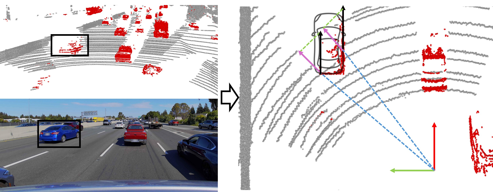
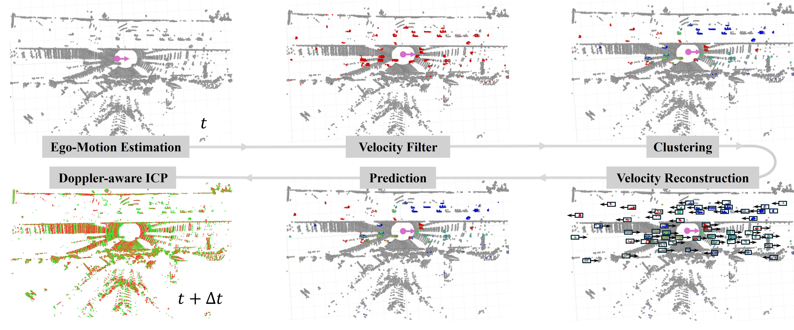
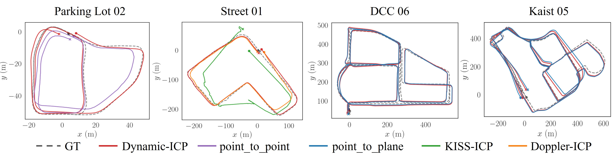

<h1 align="center">
  Dynamic-ICP
</h1>
<h3 align="center">Doppler-Aware Iterative Closest Point Registration for Dynamic Scenes</h3>

    
   
  <em>Velocity reconstruction of dynamic objects.</em>

## Introduction

**Dynamic-ICP** is a Doppler-aware variant of ICP that explicitly models scene dynamics and fast ego motion.

*Note: Our paper is currently under review. The source code will be made available upon publication.*

## Demo
Workflow of Dynamic-ICP for dynamic objects. Left: FMCW LiDAR scan in highway scenarios. Dynamic points are colored and clustered. Right: Velocity reconstruction, prediction, and matching of dynamic objects. The raw dynamic points are colored red, while the predicted points are colored green. Black arrows and boxes represent the object's velocity and bounding box, respectively.

    

## Overview

Pipeline of Dynamic-ICP consists of four main modules: (i) Ego-Motion Estimation; (ii) Dynamic Points Clustering (Velocity Filter, Clustering and Velocity Reconstruction); (iii) Dynamic Points Prediction; and (iv) Doppler-aware ICP Matching. The figure illustrates the workflow on point cloud data: starting from a raw scan, ego velocity (arrows) is estimated from per-point Doppler velocity. The velocity filter distinguishes dynamic points (red) from the static background (gray) and clusters the dynamic set into individual objects (colored). For each cluster, the object velocity is reconstructed from its points’ Doppler velocities, yielding a velocity vector and a bounding box (black arrow and box). These velocities are then used to predict object states to the next frame. Finally, the scan (green) at time t (predicted dynamic points, together with the static points) are aligned to the scan (red) at time t + \Delta t via Doppler-aware ICP.

    

### Experiment

**Qualitative trajectories for the best-performing methods**

 
    

## Quick Start

todo