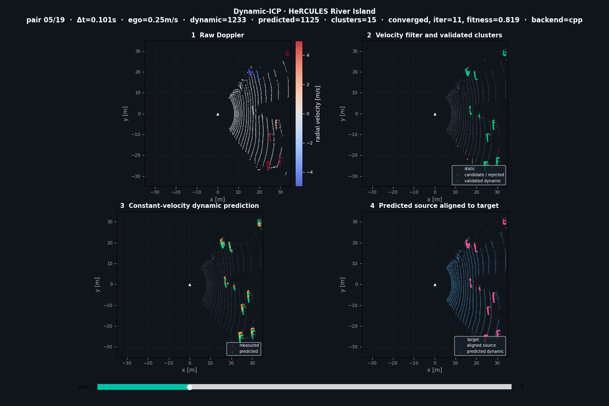

# Dynamic-ICP

**Doppler-Aware Iterative Closest Point Registration for Dynamic Scenes**

Dong Wang, Daniel Casado Herraez, Stefan May, and Andreas Nüchter

[Paper](docs/dynamic_icp_paper.pdf) · [arXiv](https://arxiv.org/abs/2511.20292) ·
[IEEE RA-L](https://doi.org/10.1109/LRA.2026.3669808)

Dynamic-ICP registers consecutive FMCW LiDAR scans without an IMU or GNSS. It
uses per-return radial velocity to estimate ego motion, identify moving
objects, predict their displacement, and optimize geometric and Doppler
residuals together. This repository provides a readable NumPy implementation
and a pybind11 C++ backend built against the pinned Doppler-capable Open3D
submodule.



## Method

For each adjacent scan pair, the pipeline:

1. estimates sensor velocity with robust Doppler regression;
2. detects returns inconsistent with the static-scene model;
3. clusters dynamic returns and reconstructs well-conditioned object velocity;
4. predicts validated dynamic points with a constant-velocity model; and
5. minimizes point-to-plane geometry and a rotation-only Doppler residual.

Transforms use `T_target_source`: they map the previous scan into the current
scan. Exported TUM poses use `T_world_sensor`. Positive Doppler means motion
away from the sensor. Distances are metres, velocities are metres per second,
and timestamps are seconds.

## Quick start with Docker

Docker builds the pinned Open3D fork, the C++ backend, and all Python
dependencies, then runs the tests. Git LFS is required to fetch the included
HeRCULES demo scans.

```bash
git lfs install
git clone --recurse-submodules https://github.com/JMUWRobotics/Dynamic-ICP.git
cd Dynamic-ICP
git lfs pull
docker build --build-arg BUILD_JOBS=4 -t dynamic-icp .
mkdir -p outputs
```

Run the included 20-frame HeRCULES demo:

```bash
docker run --rm \
  -v "$PWD/dataset/hercules_dynamic:/data:ro" \
  -v "$PWD/outputs:/output" \
  dynamic-icp \
  --scans /data/scans --layout npz --filename-time-unit ns \
  --backend cpp --gt /data/ground_truth.tum --output /output/hercules_demo
```

Create the four-panel animation shown above:

```bash
docker run --rm \
  -v "$PWD/outputs:/output" \
  --entrypoint dynamic-icp-viewer dynamic-icp \
  dataset/hercules_dynamic --save /output/hercules_dynamic.gif
```

The output directory passed to `dynamic-icp` must be new or empty.

## Local installation

Python 3.8 or newer is required.

```bash
python3 -m venv .venv
source .venv/bin/activate
python -m pip install --upgrade pip
python -m pip install -e '.[test,viewer]'
python -m pytest -q
```

This installs the NumPy backend. For the C++ backend, install CMake 3.20+, a
C++14 compiler, OpenMP, pybind11, and a compatible Open3D C++ installation,
then run:

```bash
git submodule update --init Open3D
python -m pip install -e '.[native,test,viewer]'
bash scripts/build_native.sh -DOpen3D_DIR=/path/to/lib/cmake/Open3D
```

See [native/README.md](native/README.md) for ABI requirements. The Dockerfile
is the reproducible native build when a compatible host Open3D is unavailable.

## Demo viewer

`dataset/hercules_dynamic` contains 20 consecutive high-dynamic frames from
HeRCULES River Island / `01_day` (source indices 3055–3074), voxelized at
0.3 m. Start the viewer with:

```bash
dynamic-icp-viewer dataset/hercules_dynamic --play
```

The panels show raw Doppler, filtered and validated clusters, dynamic
prediction, and the final aligned pair. Space pauses playback; Left/A and
Right/D change pairs; Home/End jumps to the first or last pair. The viewer uses
the C++ backend when available and otherwise uses NumPy.

Across the 19 demo pairs, the current C++ backend converges on every pair and
obtains **0.01049 m RTE RMSE / 0.01032° RRE RMSE** against the included ground
truth. This selected interval is an installation and visualization demo, not a
paper-table aggregate. Provenance and preprocessing are recorded in
`dataset/hercules_dynamic/metadata.json`.

## Run on other data

```bash
dynamic-icp \
  --scans /path/to/scans \
  --layout xyzd \
  --filename-time-unit ns \
  --config configs/datasets/reference.json \
  --backend cpp \
  --gt /path/to/poses.tum \
  --output outputs/run
```

Choose one timing source: `--filename-time-unit {s,ms,us,ns}`,
`--timestamps timestamps.txt`, or `--period 0.1`. Use `--start`/`--stop` for an
interval, `--doppler-sign -1` for positive-toward measurements, and
`--ablation {full,no_vf,no_dpp,no_dr}` for paper ablations. Run
`dynamic-icp --help` for every option.

| Layout | Per-point data |
| --- | --- |
| `xyzd` | little-endian float32 `[x, y, z, Doppler]` |
| `aeva25` | packed Aeva `[x, y, z, reflectivity, velocity, time_offset_ns, line_index]` |
| `aeva29` | `aeva25` plus float32 intensity |
| `npz` | `points`, `doppler`, optional `los` and `time_offsets` |

For compensated or merged scans, preserve each return's original line of sight
in the same coordinate frame as the points. Recomputing it from warped points
changes the Doppler residual.

Full paper-sequence runners and manifests are in
`scripts/run_{hercules,aevascenes}_paper_sequences.py` and `configs/datasets/`.
They store resumable per-sequence results below the requested output directory
and write the frame-weighted aggregate to `batch_summary.json`.

The dataset-independent `dynamic-icp` command writes `trajectory.tum`, per-pair
diagnostics in `pairs.jsonl`, exact arguments and dependency metadata in
`run.json`, and aggregate accuracy/runtime metrics in `summary.json`.

## Configuration

`configs/datasets/reference.json` contains the paper-method defaults, including
`lambda_doppler=0.2`, Tukey constants 0.5/0.3, HDBSCAN sizes 30/10, 100 ICP
iterations, tolerance `1e-5`, and a 0.3 m correspondence threshold.

## Repository layout

```text
dynamic_icp/   Registration pipeline, command-line tools, and paper runners
native/        pybind11 bridge for the C++ registration backend
Open3D/        pinned Doppler-capable Open3D submodule
configs/       method parameters and paper sequence manifests
scripts/       native build and paper-sequence runners
tests/         deterministic algorithm and backend tests
dataset/       compact HeRCULES viewer demo
docs/          manuscript PDF and repository images
```

## Acknowledgements

This work builds on [Open3D](https://github.com/isl-org/Open3D) and the
[Aeva Doppler-capable Open3D fork](https://github.com/aevainc/Open3D), as well
as the original [DICP: Doppler Iterative Closest Point](https://github.com/aevainc/Doppler-ICP)
implementation and paper. We thank the teams behind the
[AevaScenes](https://github.com/aevainc/aevascenes),
[HeRCULES](https://sites.google.com/view/herculesdataset), and
[HeLiPR](https://sites.google.com/view/heliprdataset) datasets for making their
FMCW LiDAR data and benchmarks available. The implementation also relies on
[NumPy](https://numpy.org/), [SciPy](https://scipy.org/),
[HDBSCAN](https://github.com/scikit-learn-contrib/hdbscan),
[pybind11](https://github.com/pybind/pybind11), and
[Matplotlib](https://matplotlib.org/).

The included HeRCULES excerpt remains subject to the original dataset terms;
confirm redistribution permission with the dataset maintainers before
republishing it. Third-party software inside the Open3D submodule retains its
own licenses.

## Citation

```bibtex
@ARTICLE{11419773,
  author={Wang, Dong and Herraez, Daniel Casado and May, Stefan and N{\"u}chter, Andreas},
  journal={IEEE Robotics and Automation Letters},
  title={Dynamic-ICP: Doppler-Aware Iterative Closest Point Registration for Dynamic Scenes},
  year={2026},
  volume={11},
  number={4},
  pages={5174-5181},
  keywords={Doppler effect;Sensors;Dynamics;Vehicle dynamics;Three-dimensional displays;Estimation;Point cloud compression;Laser radar;Accuracy;Velocity measurement;Odometry;mapping;localization;SLAM;autonomous vehicle navigation},
  doi={10.1109/LRA.2026.3669808}
}
```

## License

Dynamic-ICP is released under the [MIT License](LICENSE).
